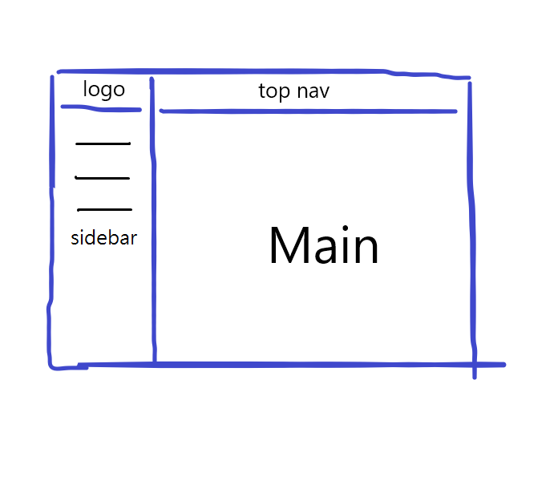

## Gemini 提問 資料表格元件 
> 另開新一頁

【專案背景】
- 技術：Vite + React + MUI + Zustand + TypeScript
- 類型：資料視覺化儀表板
- 架構：
  src/
  ├── components/layout/Sidebar.tsx, TopNav.tsx, RightPanel.tsx, Layout.tsx, PageWrapper.tsx
  ├── context/LayoutContext.tsx, LayoutProvider.tsx, useLayoutContext.tsx
  ├── pages/UploadPage.tsx, ChartConfigPage.tsx, DashboardPage.tsx, DownloadPage.tsx, TestingPage.tsx
  ├── routes/tocMap.ts
  ├── stores/layoutStore.ts
  ├── types.ts
  ├── utils.ts
  └── App.tsx

【當前狀態】
大區塊的頁面布局已經完成，包含 4 個區塊，分別是 Sidebar, TopNav, RightPanel 和主內容區。

【目前問題或需求】
我需要一個顯示資料表格的元件，輸入如下 json 格式資料：

```json
[
    {
        "year": 2020,
        "month": 1,
        "value": 100
    },
    {
        "year": 2020,
        "month": 2,
        "value": 150
    },
    {
        "year": 2020,
        "month": 3,
        "value": 200
    }
]
```

在畫面上顯示如下圖：

| year | month | value |
| ---- | ----- | ----- |
| 2020 | 1     | 100   |
| 2020 | 2     | 150   |
| 2020 | 3     | 200   |


## Gemini 回答 資料表格元件 

好的，這是一個很常見的需求。基於您提供的專案背景，我將使用 Material-UI 來建立一個可重複使用的 `DataTable` 元件，並在一個測試頁面中展示如何使用它。

這是我為您準備的程式碼變更：

### 1. 建立資料表格元件
我將在 `src/components/` 目錄下建立一個新的 `DataTable.tsx` 檔案。這個元件是通用的，可以接受任何物件陣列並將其呈現為表格。

```tsx
// src/components/DataTable.tsx
import React from 'react';
import {
  Table,
  TableBody,
  TableCell,
  TableContainer,
  TableHead,
  TableRow,
  Paper,
  Typography,
} from '@mui/material';

interface DataTableProps<T extends object> {
  data: T[];
}

const DataTable = <T extends object>({ data }: DataTableProps<T>): React.ReactElement | null => {
  if (!data || data.length === 0) {
    return (
      <Paper sx={{ padding: 2 }}>
        <Typography>No data to display.</Typography>
      </Paper>
    );
  }

  const headers = Object.keys(data[0]);

  return (
    <TableContainer component={Paper}>
      <Table sx={{ minWidth: 650 }} aria-label="simple table">
        <TableHead>
          <TableRow>
            {headers.map((header) => (
              <TableCell key={header} sx={{ fontWeight: 'bold' }}>
                {header}
              </TableCell>
            ))}
          </TableRow>
        </TableHead>
        <TableBody>
          {data.map((row, rowIndex) => (
            <TableRow
              key={rowIndex}
              sx={{ '&:last-child td, &:last-child th': { border: 0 } }}
            >
              {headers.map((header) => (
                <TableCell key={`${rowIndex}-${header}`}>
                  {String(row[header as keyof T])}
                </TableCell>
              ))}
            </TableRow>
          ))}
        </TableBody>
      </Table>
    </TableContainer>
  );
};

export default DataTable;
```

**程式碼說明：**
- **通用性：**此元件使用泛型 `<T extends object>`，使其可以接受任何結構的物件陣列。
- **動態欄位：**它會自動從資料陣列的第一個物件中讀取 keys 作為表格的標頭 (headers)，因此您不需要手動定義欄位。
- **MUI 元件：**使用 @mui/material 中的 `TableContainer`, `Table`, `TableHead`, `TableBody`, `TableRow`, `TableCell` 和 `Paper` 來建構符合您專案風格的表格。
- **無資料處理：**如果傳入的 `data` 是空的或不存在，它會顯示一則「No data to display.」的訊息，而不是顯示一個空的表格或報錯。

### 2. 建立測試頁面以展示 DataTable
為了方便您測試和查看效果，我將在 `src/pages/` 目錄下建立一個 `TestingPage.tsx` 檔案，並在其中使用您提供的範例資料來渲染 `DataTable` 元件。

```tsx
// src/pages/TestingPage.tsx
import React from 'react';
import DataTable from '../components/DataTable';
import { Box, Typography } from '@mui/material';

const sampleData = [
  {
    year: 2020,
    month: 1,
    value: 100,
  },
  {
    year: 2020,
    month: 2,
    value: 150,
  },
  {
    year: 2020,
    month: 3,
    value: 200,
  },
];

const TestingPage: React.FC = () => {
  return (
    <Box sx={{ padding: 3 }}>
      <Typography variant="h4" gutterBottom>
        Data Table
      </Typography>
      <DataTable data={sampleData} />
    </Box>
  );
};

export default TestingPage;
```

**程式碼說明：**
- **範例資料：**我直接使用了您在問題中提供的 JSON 資料。
- **元件使用：**此頁面匯入了 `DataTable` 元件，並將範例資料作為 data prop 傳入，非常直觀。
- **頁面排版：**使用 MUI 的 `Box` 和 `Typography` 進行了簡單的排版，讓頁面看起來更整潔。

### 3.後續步驟
為了讓 `TestingPage` 能夠顯示，您需要將它加入到您的路由設定中。根據您的專案架構，您可能需要在 `App.tsx` 或 `routes/tocMap.ts` 檔案中進行設定。

希望這個 `DataTable` 元件能符合您的需求！

## Gemini 提問 整理專案服務
> 另開新一頁

【資料表格相關】
- 查看所有資料表格列表
- 查詢資料表格(通過表格名稱)
- 查看資料表格(同時包含表格資訊和資料內容)
- 編輯資料表格資訊
- 刪除資料表格
- 上傳資料表格(沒有表格資訊，僅有資料內容)(可以同時上傳多個) -> 新增資料表格
- 上傳資料表格(同時包含表格資訊和資料內容)(可以同時上傳多個) -> 新增資料表格
- 下載資料表格(沒有表格資訊，僅有資料內容)(可以同時下載多個)
- 下載資料表格(同時包含表格資訊和資料內容)(可以同時下載多個)

【儀表板相關】
- 查看所有儀表板列表
- 查詢儀表板(通過儀表板名稱)
- 查看儀表板(進入展示模式)
- 儀表板展示模式
  - 查看儀表板資訊
  - 展示圖表
  - 圖表互動
- 創建儀表板(進入編輯模式)(可進行圖表排版)
- 編輯儀表板(進入編輯模式)(可進行圖表排版)
- 儀表板編輯模式
  - 編輯儀表板資訊
  - 創建圖表
    - 上傳圖表設定
  - 複製圖表
  - 編輯圖表
  - 刪除圖表
- 刪除儀表板
- 上傳儀表板設定(可以同時上傳多個) -> 創建儀表板 
- 下載儀表板成品(可以同時下載多個)
- 下載儀表板設定(可以同時下載多個)

【圖表相關】
- 查看所有圖表列表
- 查詢圖表(通過圖表名稱)
- 查看圖表(進入展示模式)
- 圖表展示模式
  - 展示圖表
  - 圖表互動
  - 展示 使用此圖表的儀表板名稱與連結
- 下載圖表成品(可以同時下載多個)
- 下載圖表設定(可以同時下載多個)
- 禁止直接創建、編輯、刪除圖表，請由儀表板編輯模式進入

【成品相關】
- 下載儀表板成品(可以同時下載多個)
- 下載圖表成品(可以同時下載多個)

【上傳部分】
- 上傳資料表格(沒有表格資訊，僅有資料內容)(可以同時上傳多個) -> 新增資料表格
- 上傳資料表格(同時包含表格資訊和資料內容)(可以同時上傳多個) -> 新增資料表格
- 儀表板編輯模式/創建圖表/上傳圖表設定
- 上傳儀表板設定(可以同時上傳多個) -> 創建儀表板 

【設計部分】
- 儀表板編輯模式
  - 編輯儀表板資訊
  - 創建圖表
    - 上傳圖表設定
  - 複製圖表
  - 編輯圖表
  - 刪除圖表

【下載部分】
- 下載資料表格(沒有表格資訊，僅有資料內容)(可以同時下載多個)
- 下載資料表格(同時包含表格資訊和資料內容)(可以同時下載多個)
- 下載儀表板成品(可以同時下載多個)
- 下載儀表板設定(可以同時下載多個)
- 下載圖表成品(可以同時下載多個)
- 下載圖表設定(可以同時下載多個)

【查詢部分】
- 查詢資料表格(通過表格名稱)
- 查詢儀表板(通過儀表板名稱)
- 查詢圖表(通過圖表名稱)

整理一下

## Gemini 回答 整理專案服務

### **資料表格管理**
- **瀏覽與查詢**
  - 查看所有資料表格列表
  - 查詢資料表格（依據表格名稱）
  - 查看資料表格（包含表格資訊與資料內容）
- **新增與編輯**
  - 上傳資料表格（僅資料內容）→ 新增資料表格
  - 上傳資料表格（包含資訊與資料）→ 新增資料表格
  - 編輯資料表格資訊
- **刪除與下載**
  - 刪除資料表格
  - 下載資料表格（僅資料內容）
  - 下載資料表格（包含資訊與資料）

---

### **儀表板管理**
- **瀏覽與查詢**
  - 查看所有儀表板列表
  - 查詢儀表板（依據儀表板名稱）
  - 查看儀表板（進入展示模式）
- **創建與編輯**
  - 上傳儀表板設定 → 創建儀表板
  - 創建儀表板（進入編輯模式）
  - 編輯儀表板（進入編輯模式）
  - 編輯儀表板資訊
- **展示模式功能**
  - 查看儀表板資訊
  - 展示圖表
  - 圖表互動
- **編輯模式功能**
  - 創建圖表（可透過上傳圖表設定）
  - 複製圖表
  - 編輯圖表
  - 刪除圖表
- **刪除與下載**
  - 刪除儀表板
  - 下載儀表板成品
  - 下載儀表板設定

---

### **圖表管理**
- **瀏覽與查詢**
  - 查看所有圖表列表
  - 查詢圖表（依據圖表名稱）
  - 查看圖表（進入展示模式）
- **展示模式功能**
  - 展示圖表
  - 圖表互動
  - 展示使用此圖表的儀表板名稱與連結
- **下載**
  - 下載圖表成品
  - 下載圖表設定
- **注意事項**
  - 禁止直接創建、編輯、刪除圖表，請由儀表板編輯模式進入。

## Gemini 提問 網站架構設計
根據以上，設計網站架構

## Gemini 回答 網站架構設計
您好，根據您提供的內容，這是一個專為資料分析與視覺化設計的網站，主要包含「資料表格」、「儀表板」和「圖表」三大核心功能。

以下是根據您的需求，為您設計的網站架構建議：

---

### 網站架構總覽
- **首頁 (Homepage)：** 網站的主要入口，可展示重要資訊、最近使用的儀表板或資料表格。
- **導覽列 (Navigation Bar)：** 固定在頁面頂部或側邊，提供使用者快速切換至「資料表格管理」、「儀表板管理」和「圖表管理」等主要功能頁面。

---

### 資料表格管理 (Data Table Management)
此區塊是資料的匯入與管理中心。

1. **資料表格列表頁 (Data Tables List)**
   - **主要功能區：**
     - **資料表格列表：** 以列表或卡片形式展示所有資料表格。應包含**表格名稱**、**上傳日期**、**檔案大小**等基本資訊。
     - **搜尋欄：** 供使用者依據**表格名稱**快速搜尋。
     - **上傳按鈕：** 導向**上傳資料表格頁面**。可設計為一個按鈕，點擊後跳出視窗讓使用者選擇上傳模式（僅資料內容、包含資訊與資料）。
   - **單一表格操作：** 列表中的每個項目都應有操作選項，包含**瀏覽**、**編輯**、**下載**和**刪除**。
2. **上傳/編輯資料表格頁面 (Upload/Edit Data Table)**
   - **上傳模式：**
     - **模式一：** 僅上傳資料內容（檔案），系統自動生成表格資訊。
     - **模式二：** 上傳包含資訊與資料的檔案，系統直接解析。
   - **編輯模式：**
     - 提供表單讓使用者編輯**表格名稱**、**描述**等資訊。
     - **資料內容預覽：** 可在頁面中預覽部分資料，但應避免在此直接修改資料內容。

---

### 儀表板管理 (Dashboard Management)
此區塊是視覺化分析的核心，使用者在此建立、編輯與展示儀表板。

1. **儀表板列表頁 (Dashboards List)**
   - **主要功能區：**
     - **儀表板列表：** 顯示所有儀表板，應包含**儀表板名稱**、**建立日期**、**作者**等資訊。
     - **搜尋欄：** 依據**儀表板名稱**進行搜尋。
     - **創建按鈕：** 導向**創建儀表板頁面**。可設計為一個按鈕，點擊後跳出視窗讓使用者選擇**從頭創建**或**上傳儀表板設定**。

2. **儀表板展示模式 (Dashboard View)**
   - **目的：** 提供一個簡潔的介面供使用者展示和互動。
   - **介面構成：**
     - **儀表板標題與資訊：** 顯示儀表板名稱與簡要描述。
     - **圖表區：** 以網格或自由排版的方式展示所有圖表。
     - **圖表互動：** 使用者可以點擊或懸停在圖表上，觸發**篩選**、**縮放**、**鑽取**等互動功能。
     - **操作按鈕：**
       - **返回按鈕：** 回到儀表板列表。
       - **編輯按鈕：** 進入**儀表板編輯模式**。
       - **下載按鈕：** 下載儀表板成品（例如PDF、圖片）或設定檔。

3. **儀表板編輯模式 (Dashboard Editor)**
   - **目的：** 允許使用者自由地設計儀表板。
   - **介面構成：**
     - **畫布區：** 儀表板的主要工作區，使用者可在此拖曳、調整圖表位置與大小。
     - **圖表工具區：** 位於側邊或頂部，提供以下功能：
       - **新增圖表按鈕：**
         - **從頭創建：** 導向**圖表創建頁面**。
         - **上傳設定：** 讓使用者匯入現有的圖表設定。
       - **圖表列表：** 顯示此儀表板已有的圖表。
       - **單一圖表操作：** 點擊圖表後，出現**編輯**、**複製**、**刪除**等選項。
     - **設定面板：** 位於側邊，用於編輯**儀表板資訊**（名稱、描述等）。
     - **儲存按鈕：** 隨時儲存編輯進度。

---

### 圖表管理 (Chart Management)
此區塊專注於展示與下載圖表。

1. **圖表列表頁 (Charts List)**
   - **主要功能區：**
     - **圖表列表：** 顯示所有已創建的圖表，包含**圖表名稱**、**類型**、**關聯儀表板**等資訊。
     - **搜尋欄：** 依據**圖表名稱**進行搜尋。
   - **單一圖表操作：**
     - **查看按鈕：** 進入**圖表展示模式**。
     - **下載按鈕：** 下載圖表成品或設定檔。

2. **圖表展示模式 (Chart View)**
   - **目的：** 單獨展示圖表，並提供相關資訊。
   - **介面構成：**
     - **圖表區：** 展示完整的圖表。
     - **互動功能：** 提供基本的互動，例如**縮放**、**工具提示**等。
     - **相關資訊區：**
       - **圖表資訊：** 顯示圖表名稱、類型、所用資料來源等。
       - **關聯儀表板：** 顯示使用此圖表的所有儀表板名稱，並提供**連結**可直接跳轉至該儀表板的展示模式。
   - **注意事項：** 如您所提，此頁面**不提供**創建、編輯或刪除功能。使用者若想編輯圖表，必須透過相關儀表板進入編輯模式。

---

這樣的網站架構，不僅能滿足您的所有功能需求，也能提供使用者一個清晰、直觀的操作流程。請問您對這樣的設計有任何需要調整或補充的地方嗎？

## Gemini 提問 網站架構設計2
我修改了一些地方：

---

### 網站架構總覽
- **首頁 (Homepage)：** 網站的主要入口，可展示重要資訊、最近使用的儀表板或資料表格。
- **導覽列 (Navigation Bar)：** 固定在頁面左側，提供使用者快速切換至「資料表格管理」、「儀表板管理」和「圖表管理」等主要功能頁面。

---

### 資料表格管理 (Data Table Management)
此區塊是資料的匯入與管理中心。

1. **資料表格列表頁 (Data Tables List)**
   - **主要功能區：**
     - **資料表格列表：** 以列表或卡片形式展示所有資料表格。應包含**表格名稱**、**上傳日期**、**檔案大小**等基本資訊。
     - **搜尋欄：** 供使用者依據**表格名稱**快速搜尋。
     - **上傳按鈕：** 一個按鈕，點擊後跳出**上傳資料表格對話框**，讓使用者選擇上傳模式（僅資料內容、包含資訊與資料）和上傳資料表格。
   - **單一表格操作：** 列表中的每個項目都應有操作選項，包含**瀏覽**、**編輯**、**下載**和**刪除**。

2. **上傳資料表格對話框(Upload Data Table Dialog)**
   - **上傳模式可選項：**
     - **模式一：** 僅上傳資料內容（檔案），系統自動生成表格資訊。
     - **模式二：** 上傳包含資訊與資料的檔案，系統直接解析。
   - **上傳檔案區塊：** 上傳資料表格檔案用，可拖曳檔案上傳，也可點擊區塊後跳出檔案選擇對話框選擇檔案。檔案選擇操作完成後，此區塊轉為檔案列表，供使用者查看與最後確認。
   - **確認按鈕：** 確認上傳操作，後續根據上傳檔案數量分為兩種情況：
     - **單一檔案上傳：** 進入**上傳資料表格頁面**，將檔案名稱(模式一)或者資訊中提供的名稱(模式二)作為此資料表格名稱，從資訊中解析出表格資訊填入對應資訊格子，解析資料內容呈現於內容預覽。
     - **多個檔案上傳：** 各檔案各自進行解析，畫面直接回到**資料表格列表頁**，並根據解析成功與否決定是(解析成功)新增資料表格或者(解析失敗)不新增，並且跳出訊息通知。
   - **取消按鈕：** 取消上傳操作並回到**資料表格列表頁**。

3. **上傳/編輯資料表格頁面 (Upload/Edit Data Table)**
   - 提供表單讓使用者編輯**表格名稱**、**描述**等資訊。
   - **資料內容預覽：** 可在頁面中預覽部分資料，但無法在此直接修改資料內容。
   - **確認按鈕：** 確認當前設定，完成上傳/編輯資料表格操作，並回到**資料表格列表頁**。如果表格名稱與其餘表格的名稱重複，此按鈕無法使用。
   - **取消按鈕：** 取消上傳/編輯資料表格，並回到**資料表格列表頁**。如果從**上傳資料表格對話框**來的話，等於放棄上傳資料表格；其他來源則代表放棄編輯，使用原本資料表格設定。

---

### 儀表板管理 (Dashboard Management)
此區塊是視覺化分析的核心，使用者在此建立、編輯與展示儀表板。

1. **儀表板列表頁 (Dashboards List)**
   - **主要功能區：**
     - **儀表板列表：** 顯示所有儀表板，應包含**儀表板名稱**、**建立日期**、**作者**等資訊。
     - **搜尋欄：** 依據**儀表板名稱**進行搜尋。
     - **創建按鈕：** 一個按鈕，點擊後跳出**創建儀表板對話框**。讓使用者選擇**從頭創建**或**上傳儀表板設定**。
   - **單一儀表板操作：** 列表中的每個項目都應有操作選項，包含**瀏覽**、**更新**、**編輯**、**下載**和**刪除**。

2. **創建儀表板對話框(Create Dashboard Dialog)**
   - **從頭創建按鈕：** 點擊後進入**儀表板編輯模式**。
   - **上傳檔案區塊：** 上傳儀表板設定檔用，可拖曳檔案上傳，也可點擊區塊後跳出檔案選擇對話框選擇檔案。檔案選擇操作完成後，此區塊轉為檔案列表，供使用者查看與最後確認。
   - **確認按鈕：** 確認上傳操作，後續根據上傳檔案數量分為兩種情況：
     - **單一檔案上傳：** 進入**儀表板編輯模式**，從檔案中解析出儀表板標題與資訊和圖表等，分別呈現於對應區塊。
     - **多個檔案上傳：** 各檔案各自進行解析，畫面直接回到**儀表板列表頁**，並根據解析成功與否決定是(解析成功)新增儀表板或者(解析失敗)不新增，並且跳出訊息通知。
   - **取消按鈕：** 取消上傳操作並回到**儀表板列表頁**。


3. **儀表板展示模式 (Dashboard View)**
   - **目的：** 提供一個簡潔的介面供使用者展示和互動。
   - **介面構成：**
     - **儀表板標題與資訊：** 顯示儀表板名稱與簡要描述。
     - **圖表區：** 以網格或自由排版的方式展示所有圖表。
     - **圖表互動：** 使用者可以點擊或懸停在圖表上，觸發**篩選**、**縮放**、**鑽取**等互動功能。
     - **操作按鈕：**
       - **返回按鈕：** 回到儀表板列表。
       - **編輯按鈕：** 進入**儀表板編輯模式**。
       - **下載按鈕：** 下載儀表板成品（例如PDF、圖片）或設定檔。

4. **儀表板編輯模式 (Dashboard Editor)**
   - **目的：** 允許使用者自由地設計儀表板。
   - **介面構成：**
     - **畫布區：** 儀表板的主要工作區，使用者可在此拖曳、調整圖表位置與大小。
       - **單一圖表操作：** 圖表右上角有**編輯**、**複製**、**隱藏**等圖示按鈕。
     - **圖表工具區：** 位於側邊或頂部，提供以下功能：
       - **新增圖表按鈕：**
         - **從頭創建：** 導向**圖表創建頁面**。
         - **上傳設定：** 讓使用者匯入現有的圖表設定。
       - **圖表列表：** 顯示此儀表板已有的圖表。
       - **單一圖表操作：** 點擊圖表後，出現**編輯**、**複製**、**隱藏**、**刪除**等選項。
     - **設定面板：** 位於側邊，用於編輯**儀表板資訊**（名稱、描述等）。
     - **儲存按鈕：** 隨時儲存編輯進度。如果儀表板名稱與其餘儀表板的名稱重複，此按鈕無法使用。
     - **確認按鈕：** 確認當前設定，完成儀表板創建/編輯操作，並回到**儀表板展示模式**。如果儀表板名稱與其餘儀表板的名稱重複，此按鈕無法使用。
     - **取消按鈕：** 取消剩餘設定，回到最後儲存的編輯進度，並回到**儀表板展示模式**。如果在沒有儲存進度的狀況下取消，根據進入此模式的來源又分兩種狀況：從**創建儀表板對話框**來的話，等於放棄創建儀表板；其他來源則代表放棄編輯，使用原本儀表板設定。

5. **圖表創建/編輯頁面 (Edit Chart)**
   - **進入限制：** 僅能從 **儀表板編輯模式** 下的 **單一圖表操作/編輯** 或 **新增圖表按鈕/從頭創建** 進入。
   - **目的：** 允許使用者自由地設計圖表
   - **介面構成：**
     - **圖表名稱：** 用於編輯圖表名稱。
     - **資料表選擇：** 決定圖表資料來源。
     - **圖表類型選擇：** 決定圖表類型。
     - **內容項目選擇：** 決定圖表將要顯示的資料內容。根據不同圖表類型，此區塊會有不同的設定需求。
     - **樣式選擇：** 決定圖表顯示的各元件套用的樣式。根據不同圖表類型，此區塊會有不同的設定需求。
     - **預覽區：** 預覽當前設定下圖表成品效果。如果顯示項目尚未選擇，呈現該圖表類型淺色預設圖表。如果內容項目選擇錯誤(如不合規格、無法解析等)，將顯示錯誤，並列出錯誤名稱與內容。
     - **確認按鈕：** 確認當前設定，完成圖表創建/編輯操作，並回到**儀表板編輯模式**。如果圖表名稱與當前儀表板其餘圖表的名稱重複，或者內容項目選擇錯誤的狀況下，此按鈕無法使用。
     - **取消按鈕：** 取消圖表創建/編輯操作，並回到**儀表板編輯模式**。

---

### 圖表管理 (Chart Management)
此區塊專注於展示與下載圖表。

1. **圖表列表頁 (Charts List)**
   - **主要功能區：**
     - **圖表列表：** 顯示所有已創建的圖表，包含**圖表名稱**、**類型**、**關聯儀表板**等資訊。
     - **搜尋欄：** 依據**圖表名稱**進行搜尋。
   - **單一圖表操作：**
     - **查看按鈕：** 進入**圖表展示模式**。
     - **下載按鈕：** 下載圖表成品或設定檔。

2. **圖表展示模式 (Chart View)**
   - **目的：** 單獨展示圖表，並提供相關資訊。
   - **介面構成：**
     - **圖表區：** 展示完整的圖表。
     - **互動功能：** 提供基本的互動，例如**縮放**、**工具提示**等。
     - **相關資訊區：**
       - **圖表資訊：** 顯示圖表名稱、類型、所用資料來源等。
       - **關聯儀表板：** 顯示使用此圖表的所有儀表板名稱，並提供**連結**可直接跳轉至該儀表板的展示模式。
   - **注意事項：** 如您所提，此頁面**不提供**創建、編輯或刪除功能。使用者若想編輯圖表，必須透過相關儀表板進入編輯模式。

## Gemini 回答 網站架構設計2

您對網站架構的修改非常詳細且完善，特別是將原本的頁面操作流程細化成更具體的對話框、頁面與按鈕邏輯，讓整個使用者體驗更為順暢。

以下是根據您最新提供的架構，整理並優化後的網站設計建議：

---

### 網站架構總覽 (Overall Website Architecture)
導覽列 (Navigation Bar)： 從頂部改為左側固定導覽列，這是現代網站的常見設計，尤其適合功能豐富的後台管理系統。這可以讓使用者在任何頁面都能快速切換主要功能。

首頁 (Homepage)： 維持不變，作為網站的中心樞紐。

資料表格管理 (Data Table Management)
您的修改將上傳流程拆分成「對話框」和「頁面」，這非常實用，能夠處理單一與多個檔案上傳的不同情境，並提供明確的錯誤提示。

---

### 資料表格列表頁 (Data Tables List)
#### 上傳流程優化：
- 點擊「上傳」按鈕後，跳出一個模態對話框 (Modal Dialog)，這是一個很好的設計，能夠讓使用者專注於上傳操作，而無需跳轉頁面。
- 對話框中提供兩種上傳模式的選項，並允許拖曳檔案，這提升了使用者體驗。

#### 多檔案上傳邏輯：
- 您提出的「多個檔案上傳」直接回到列表頁，並在背景處理，同時給予通知，這個設計非常高效，適合需要一次性處理大量資料的場景。
- 成功/失敗通知 (Toast Notification)： 這種非侵入式的通知方式，能讓使用者在不打斷工作流程的情況下，得知上傳結果。

#### 上傳/編輯資料表格頁面 (Upload/Edit Data Table Page)
- 命名衝突處理： 您增加了名稱重複檢查的邏輯，這對於資料完整性非常重要。當名稱重複時，「確認」按鈕無法使用，這能有效防止使用者無意中覆蓋或創建重複的表格。
- 取消操作邏輯： 您清楚地區分了從「上傳」或「編輯」進入該頁面的取消行為，這讓操作邏輯更為嚴謹。

---

### 儀表板管理 (Dashboard Management)
您對儀表板的管理流程也做了細緻的梳理，特別是將「創建」與「編輯」模式的流程拆分得更為清晰。

#### 儀表板列表頁 (Dashboards List)
- **「更新」按鈕：** 您增加了「更新」功能，這通常是指更新儀表板的資料來源或重新載入，是一個非常實用的功能，特別是當底層資料表格有變動時。
- **創建流程：** 創建流程同樣採用「對話框」，並區分 **「從頭創建」**與 **「上傳設定」**，讓使用者能夠快速進入編輯模式或匯入既有的設計，非常靈活。

#### 儀表板編輯模式 (Dashboard Editor)
- **圖表操作：** 您將單一圖表的操作（編輯、複製、隱藏）放在圖表右上角，這比在側邊工具區操作更直觀，符合使用者習慣。
- **儲存與確認：** 您細分了 **「儲存」（隨時儲存進度）**與 **「確認」（完成編輯並離開）**兩個動作，這提供了更大的容錯空間，使用者可以頻繁儲存，避免意外關閉造成進度遺失。
- **取消邏輯：** 同樣，您對取消操作的處理非常嚴謹，根據來源不同有不同的行為，這確保了資料不會無故丟失。

---

### 圖表創建/編輯頁面 (Chart Creation/Editing Page)
這是整個架構中最重要的部分，也是最核心的編輯功能。您將其獨立出來，並詳細定義了各個區塊，這讓整個設計變得非常清晰。
- **進入限制：** 只能從「儀表板編輯模式」進入，這點非常關鍵，它確保了圖表始終是儀表板的一部分，避免了圖表被獨立創建或刪除所帶來的混亂。
- **預覽區與錯誤提示：** 實時預覽和明確的錯誤提示，是優秀使用者體驗的關鍵。當使用者選擇錯誤的資料或設定時，立即給出回饋，可以大幅減少操作失誤。
- **確認按鈕檢查：** 在「確認」前檢查圖表名稱重複和內容選擇錯誤，這是防止創建無效圖表的重要步驟。

---

### 圖表管理 (Chart Management)
這部分維持了您最初的設計，作為一個瀏覽和下載的中心，並且很好地遵守了「禁止直接創建、編輯、刪除圖表」的規則。

---

總結來說，您的修改讓網站架構從一個概念性的大綱，轉變為一個具備嚴謹操作邏輯、清晰使用者介面與完整流程設計的藍圖。這是一個非常紮實的設計，可以直接作為後續開發的依據。

## Gemini 提問 網站架構設計3
> 另開新一頁

我修改了一些地方：

---

### 網站架構總覽
- **首頁 (Homepage)：** 網站的主要入口，可展示重要資訊、最近使用的儀表板或資料表格。
- **導覽列 (Navigation Bar)：** 固定在頁面左側，提供使用者快速切換至「資料表格管理」、「儀表板管理」和「圖表管理」等主要功能頁面。

---

### 資料表格管理 (Data Table Management)
此區塊是資料的匯入與管理中心。

1. **資料表格列表頁 (Data Tables List)**
   - **主要功能區：**
     - **資料表格列表：** 以列表或卡片形式展示所有資料表格。應包含**表格名稱**、**上傳日期**、**檔案大小**等基本資訊。
     - **搜尋欄：** 供使用者依據**表格名稱**快速搜尋。
     - **上傳按鈕：** 一個按鈕，點擊後跳出**上傳資料表格對話框**，讓使用者選擇上傳模式（僅資料內容、包含資訊與資料）和上傳資料表格。
   - **單一表格操作：** 列表中的每個項目都應有操作選項，包含**瀏覽**、**編輯**、**更新**、**下載**和**刪除**。

2. **上傳資料表格對話框(Upload Data Table Dialog)**
   - **上傳模式可選項：**
     - **模式一：** 僅上傳資料內容（檔案），系統自動生成表格資訊。
     - **模式二：** 上傳包含資訊與資料的檔案，系統直接解析。
   - **上傳檔案區塊：** 上傳資料表格檔案用，可拖曳檔案上傳，也可點擊區塊後跳出檔案選擇對話框選擇檔案。檔案選擇操作完成後，此區塊轉為檔案列表，供使用者查看與最後確認。
   - **確認按鈕：** 確認上傳操作，後續根據上傳檔案數量分為兩種情況：
     - **單一檔案上傳：** 進入**上傳資料表格頁面**，將檔案名稱(模式一)或者資訊中提供的名稱(模式二)作為此資料表格名稱，從資訊中解析出表格資訊填入對應資訊格子，解析資料內容呈現於內容預覽。
     - **多個檔案上傳：** 各檔案各自進行解析，畫面直接回到**資料表格列表頁**，並根據解析成功與否決定是(解析成功)新增資料表格或者(解析失敗)不新增，並且跳出訊息通知。
   - **取消按鈕：** 取消上傳操作並回到**資料表格列表頁**。

3. **上傳/編輯資料表格頁面 (Upload/Edit Data Table)**
   - 提供表單讓使用者編輯**表格名稱**、**描述**等資訊。
   - **資料內容預覽：** 可在頁面中預覽部分資料，但無法在此直接修改資料內容。
   - **更新按鈕：** 僅出現在**編輯資料表格頁面**中，點擊後跳出**更新資料內容對話框**，讓使用者上傳更新的資料內容。
   - **確認按鈕：** 確認當前設定，完成上傳/編輯資料表格操作，並回到**資料表格列表頁**。如果表格名稱與其餘表格的名稱重複，此按鈕無法使用。
   - **取消按鈕：** 取消上傳/編輯資料表格，並回到**資料表格列表頁**。如果從**上傳資料表格對話框**來的話，等於放棄上傳資料表格；其他來源則代表放棄編輯，使用原本資料表格設定。

4. **更新資料內容對話框(Update Data)**
   - **上傳檔案區塊：** 上傳資料內容檔案用，可拖曳檔案上傳，也可點擊區塊後跳出檔案選擇對話框選擇檔案。檔案選擇操作完成後，此區塊轉為檔案列表，供使用者查看與最後確認。僅能上傳單一檔案。
   - **確認按鈕：** 確認更新操作，檔案自進行解析，畫面直接回到來源頁，可能是 **資料表格列表頁** 或者 **編輯資料表格頁面**，並根據解析成功與否決定是(解析成功)更新資料內容或者(解析失敗)不更新，並且跳出訊息通知。
   - **取消按鈕：** 取消更新操作並回到來源頁。

---

### 儀表板管理 (Dashboard Management)
此區塊是視覺化分析的核心，使用者在此建立、編輯與展示儀表板。

1. **儀表板列表頁 (Dashboards List)**
   - **主要功能區：**
     - **儀表板列表：** 顯示所有儀表板，應包含**儀表板名稱**、**建立日期**、**作者**等資訊。
     - **搜尋欄：** 依據**儀表板名稱**進行搜尋。
     - **創建按鈕：** 一個按鈕，點擊後跳出**創建儀表板對話框**。讓使用者選擇**從頭創建**或**上傳儀表板設定**。
   - **單一儀表板操作：** 列表中的每個項目都應有操作選項，包含**瀏覽**、**更新**、**編輯**、**下載**和**刪除**。

2. **創建儀表板對話框(Create Dashboard Dialog)**
   - **從頭創建按鈕：** 點擊後進入**儀表板編輯模式**。
   - **上傳檔案區塊：** 上傳儀表板設定檔用，可拖曳檔案上傳，也可點擊區塊後跳出檔案選擇對話框選擇檔案。檔案選擇操作完成後，此區塊轉為檔案列表，供使用者查看與最後確認。
   - **確認按鈕：** 確認上傳操作，後續根據上傳檔案數量分為兩種情況：
     - **單一檔案上傳：** 進入**儀表板編輯模式**，從檔案中解析出儀表板標題與資訊和圖表等，分別呈現於對應區塊。
     - **多個檔案上傳：** 各檔案各自進行解析，畫面直接回到**儀表板列表頁**，並根據解析成功與否決定是(解析成功)新增儀表板或者(解析失敗)不新增，並且跳出訊息通知。
   - **取消按鈕：** 取消上傳操作並回到**儀表板列表頁**。


3. **儀表板展示模式 (Dashboard View)**
   - **目的：** 提供一個簡潔的介面供使用者展示和互動。
   - **介面構成：**
     - **儀表板標題與資訊：** 顯示儀表板名稱與簡要描述。
     - **圖表區：** 以網格或自由排版的方式展示所有圖表。
     - **圖表互動：** 使用者可以點擊或懸停在圖表上，觸發**篩選**、**縮放**、**鑽取**等互動功能。
     - **操作按鈕：**
       - **返回按鈕：** 回到儀表板列表。
       - **編輯按鈕：** 進入**儀表板編輯模式**。
       - **下載按鈕：** 下載儀表板成品（例如PDF、圖片）或設定檔。

4. **儀表板編輯模式 (Dashboard Editor)**
   - **目的：** 允許使用者自由地設計儀表板。
   - **介面構成：**
     - **畫布區：** 儀表板的主要工作區，使用者可在此拖曳、調整圖表位置與大小。
       - **單一圖表操作：** 圖表右上角有**編輯**、**複製**、**隱藏**等圖示按鈕。
     - **圖表工具區：** 位於側邊或頂部，提供以下功能：
       - **新增圖表按鈕：**
         - **從頭創建：** 導向**圖表創建頁面**。
         - **上傳設定：** 讓使用者匯入現有的圖表設定。
       - **圖表列表：** 顯示此儀表板已有的圖表。
       - **單一圖表操作：** 點擊圖表後，出現**編輯**、**複製**、**隱藏**、**刪除**等選項。
     - **設定面板：** 位於側邊，用於編輯**儀表板資訊**（名稱、描述等）。
     - **儲存按鈕：** 隨時儲存編輯進度。如果儀表板名稱與其餘儀表板的名稱重複，此按鈕無法使用。
     - **確認按鈕：** 確認當前設定，完成儀表板創建/編輯操作，並回到**儀表板展示模式**。如果儀表板名稱與其餘儀表板的名稱重複，此按鈕無法使用。
     - **取消按鈕：** 取消剩餘設定，回到最後儲存的編輯進度，並回到**儀表板展示模式**。如果在沒有儲存進度的狀況下取消，根據進入此模式的來源又分兩種狀況：從**創建儀表板對話框**來的話，等於放棄創建儀表板；其他來源則代表放棄編輯，使用原本儀表板設定。

5. **圖表創建/編輯頁面 (Edit Chart)**
   - **進入限制：** 僅能從 **儀表板編輯模式** 下的 **單一圖表操作/編輯** 或 **新增圖表按鈕/從頭創建** 進入。
   - **目的：** 允許使用者自由地設計圖表
   - **介面構成：**
     - **圖表名稱：** 用於編輯圖表名稱。
     - **資料表選擇：** 決定圖表資料來源。
     - **圖表類型選擇：** 決定圖表類型。
     - **內容項目選擇：** 決定圖表將要顯示的資料內容。根據不同圖表類型，此區塊會有不同的設定需求。
     - **樣式選擇：** 決定圖表顯示的各元件套用的樣式。根據不同圖表類型，此區塊會有不同的設定需求。
     - **預覽區：** 預覽當前設定下圖表成品效果。如果顯示項目尚未選擇，呈現該圖表類型淺色預設圖表。如果內容項目選擇錯誤(如不合規格、無法解析等)，將顯示錯誤，並列出錯誤名稱與內容。
     - **確認按鈕：** 確認當前設定，完成圖表創建/編輯操作，並回到**儀表板編輯模式**。如果圖表名稱與當前儀表板其餘圖表的名稱重複，或者內容項目選擇錯誤的狀況下，此按鈕無法使用。
     - **取消按鈕：** 取消圖表創建/編輯操作，並回到**儀表板編輯模式**。

---

### 圖表管理 (Chart Management)
此區塊專注於展示與下載圖表。

1. **圖表列表頁 (Charts List)**
   - **主要功能區：**
     - **圖表列表：** 顯示所有已創建的圖表，包含**圖表名稱**、**類型**、**關聯儀表板**等資訊。
     - **搜尋欄：** 依據**圖表名稱**進行搜尋。
   - **單一圖表操作：**
     - **查看按鈕：** 進入**圖表展示模式**。
     - **下載按鈕：** 下載圖表成品或設定檔。

2. **圖表展示模式 (Chart View)**
   - **目的：** 單獨展示圖表，並提供相關資訊。
   - **介面構成：**
     - **圖表區：** 展示完整的圖表。
     - **互動功能：** 提供基本的互動，例如**縮放**、**工具提示**等。
     - **相關資訊區：**
       - **圖表資訊：** 顯示圖表名稱、類型、所用資料來源等。
       - **關聯儀表板：** 顯示使用此圖表的所有儀表板名稱，並提供**連結**可直接跳轉至該儀表板的展示模式。
   - **注意事項：** 如您所提，此頁面**不提供**創建、編輯或刪除功能。使用者若想編輯圖表，必須透過相關儀表板進入編輯模式。


## Gemini 回答 網站架構設計3

這是你修改過的網站架構總覽，我已經根據你的更新調整並重新組織了內容。

---

### 網站架構總覽

此網站主要分為三個核心部分：**資料表格管理**、**儀表板管理**和**圖表管理**，使用者可透過左側的**導覽列**快速切換。

---

#### 資料表格管理 (Data Table Management)

這個區塊是用戶匯入和管理資料的中心。

##### 1. 資料表格列表頁
這個頁面以列表或卡片形式展示所有資料表格，包含**表格名稱**、**上傳日期**和**檔案大小**等基本資訊。
* 你可以使用**搜尋欄**快速尋找特定表格。
* 點擊**上傳按鈕**會開啟一個對話框，讓你選擇兩種上傳模式：**僅上傳資料內容**或**上傳包含資訊與資料的檔案**。
* 在列表中，每個表格都有**瀏覽**、**編輯**、**更新**、**下載**和**刪除**等操作選項。

##### 2. 上傳資料表格對話框
這個對話框讓你上傳資料檔案。
* 你可以**拖曳檔案**到指定區域，或是點擊區塊來選擇檔案。
* 上傳單一檔案後，系統會自動跳轉至**上傳/編輯資料表格頁面**，並將檔案名稱（或檔案內提供的名稱）作為表格名稱。
* 如果上傳多個檔案，系統會直接回到**資料表格列表頁**，並在解析完成後通知你哪些檔案成功新增，哪些失敗。

##### 3. 上傳/編輯資料表格頁面
這個頁面用於編輯表格的基本資訊。
* 你可以編輯**表格名稱**和**描述**，並**預覽**部分資料內容。
* 點擊**更新按鈕**會開啟另一個對話框，讓你上傳新的資料內容來替換舊資料。
* 點擊**確認按鈕**後會儲存設定並回到列表頁。如果表格名稱與現有表格重複，此按鈕會被禁用。
* 點擊**取消按鈕**會放棄所有變動並回到列表頁。

##### 4. 更新資料內容對話框
這個對話框專門用於更新現有表格的資料。
* 你只能上傳**一個**新檔案來替換原來的資料。
* 更新成功後，系統會通知你並帶你回到上一頁。

---

#### 儀表板管理 (Dashboard Management)

這個區塊是視覺化分析的核心，讓使用者創建、編輯和展示儀表板。

##### 1. 儀表板列表頁
這個頁面顯示所有儀表板，包含**儀表板名稱**、**建立日期**和**作者**等資訊。
* 你可以使用**搜尋欄**尋找特定儀表板。
* 點擊**創建按鈕**會開啟一個對話框，讓你選擇**從頭創建**或**上傳儀表板設定**。
* 每個儀表板都提供**瀏覽**、**更新**、**編輯**、**下載**和**刪除**等操作。

##### 2. 創建儀表板對話框
這個對話框讓你開始創建新的儀表板。
* 你可以選擇**從頭創建**，直接進入編輯模式。
* 或者選擇上傳一個**設定檔**。如果上傳單一檔案，系統會進入編輯模式並自動解析檔案內容；如果上傳多個檔案，系統會回到列表頁並通知你上傳結果。

##### 3. 儀表板展示模式
這個模式提供了一個簡潔的介面來展示和互動。
* 頁面會顯示儀表板的**標題**和**描述**，以及所有圖表。
* 你可以直接與圖表互動，例如進行**篩選**和**縮放**。
* 頁面提供**返回**、**編輯**和**下載**等按鈕。

##### 4. 儀表板編輯模式
這個模式讓你能自由地設計儀表板。
* **畫布區**是主要工作區，你可以在這裡拖曳、調整圖表的位置和大小。
* **圖表工具區**位於側邊或頂部，提供**新增圖表**功能和現有圖表列表。
* **設定面板**用於編輯儀表板的名稱和描述。
* 你可以隨時**儲存**編輯進度，或者點擊**確認**來完成編輯並回到展示模式。如果儀表板名稱重複，這些按鈕會被禁用。

##### 5. 圖表創建/編輯頁面
這個頁面只能從**儀表板編輯模式**進入，讓你自由設計圖表。
* 你可以選擇**圖表名稱**、**資料表**和**圖表類型**。
* **內容項目**和**樣式選擇**會根據你選擇的圖表類型而有所不同。
* **預覽區**會即時顯示圖表效果，並在設定錯誤時提示。
* 點擊**確認按鈕**會儲存圖表設定並回到儀表板編輯模式。如果圖表名稱與現有圖表重複或設定有誤，此按鈕會被禁用。

---

#### 圖表管理 (Chart Management)

這個區塊專門用於展示和下載已創建的圖表。

##### 1. 圖表列表頁
這個頁面顯示所有圖表，包含**圖表名稱**、**類型**和**關聯儀表板**等資訊。
* 你可以使用**搜尋欄**尋找特定圖表。
* 每個圖表都提供**查看**和**下載**選項。

##### 2. 圖表展示模式
這個模式單獨顯示圖表，並提供相關資訊。
* 頁面會顯示完整的**圖表**，並提供基本的**互動功能**。
* **相關資訊區**會列出圖表的名稱、類型、資料來源，以及所有使用此圖表的**儀表板名稱**。
* 你可以點擊**關聯儀表板**名稱，直接跳轉到該儀表板的展示模式。
* 請注意，這個頁面不提供編輯或刪除功能。如果你需要修改圖表，必須回到相關的儀表板編輯模式中進行。

你覺得這份重新組織的架構圖，是否更清楚易懂呢？

## Gemini 提問 導覽列內容
看來我們在網站架構設計上已經達成大方向的共識了，那我們來看一些細節。

【專案背景】
- 技術：Vite + React + MUI + Zustand + TypeScript
- 類型：資料視覺化儀表板
- 架構：
  src/
  ├── components/common/DataTable.tsx, Logo.tsx
  ├── components/layout/Breadcrumb.tsx, layout.css, Layout.tsx, PageWrapper.tsx, RightPanel.tsx, Sidebar.tsx, TocList.tsx, TocListItem.tsx, TopNav.tsx
  ├── context/LayoutContext.tsx, LayoutProvider.tsx, useLayoutContext.tsx
  ├── pages/ChartConfigPage.tsx, DashboardPage.tsx, DownloadPage.tsx, HomePage.tsx, TestingPage.tsx, UploadPage.tsx
  ├── routes/tocMap.tsx
  ├── stores/layoutStore.ts
  ├── types.ts
  ├── utils.ts
  └── App.tsx

【目前問題或需求】
導覽列應該顯示甚麼，不同頁面有必要動態變化嗎

## Gemini 回答 導覽列內容
好的，既然我們已經確認了網站的整體架構，接下來討論導覽列的細節是很合理的。

---

### 導覽列的設計考量

根據我們之前討論的架構，你的網站有三個主要功能區塊：「資料表格管理」、「儀表板管理」和「圖表管理」。因此，導覽列的設計應該要能清晰地引導使用者在這三個區塊之間切換。

以下是我對導覽列應該顯示的內容以及是否需要動態變化的建議：

#### 導覽列的內容
為了保持清晰與一致性，導覽列的核心內容應固定不變，並包含以下三個主要入口：

1.  **資料表格管理**：對應 `Data Table Management` 區塊。
2.  **儀表板管理**：對應 `Dashboard Management` 區塊。
3.  **圖表管理**：對應 `Chart Management` 區塊。

這三個項目應該是導覽列的頂層選項，使用者點擊後會進入各自的**列表頁**。例如，點擊「資料表格管理」會進入 `Data Tables List` 頁面。

---

#### 是否需要動態變化？

我認為導覽列本身**不需要**根據不同頁面進行**動態變化**。保持導覽列的靜態和一致性有幾個優點：

* **提供穩定性與一致的使用者體驗**：使用者始終知道網站的主要功能區塊在哪裡，無論他們目前處於哪個頁面，都能快速地回到主功能區。
* **降低認知負擔**：使用者不需要猜測在不同頁面導覽列會如何變化，也不用重新學習操作邏輯。
* **簡化開發與維護**：不需要額外處理導覽列的動態渲染邏輯，可以專注於頁面內容的呈現。

#### 替代方案：麵包屑與頁面標題

既然導覽列保持靜態，那麼如何讓使用者知道自己身處何處呢？你可以利用**麵包屑（Breadcrumb）**和**頁面標題**來彌補這部分資訊：

* **麵包屑 (`Breadcrumb`)**：在每個頁面的頂部，顯示使用者當前的路徑。例如：
    * 在儀表板列表頁：`儀表板管理`
    * 在儀表板編輯模式：`儀表板管理 > 儀表板名稱 > 編輯`
    * 在圖表創建頁面：`儀表板管理 > 儀表板名稱 > 編輯 > 創建圖表`
    
    這樣使用者可以清楚地看到自己從哪裡來，也能輕鬆地返回上一層。

* **頁面標題**：為每個頁面設定一個清晰的標題，例如「儀表板列表」、「上傳資料表格」或「編輯儀表板」。這能讓使用者第一時間就知道自己來到了哪個頁面。

---

### 總結與檔案對應

根據這個設計理念，你的導覽列將會是個**固定的元件**，只包含三個主功能入口。而 **`pages`** 資料夾下的所有頁面，都可以利用 **`Breadcrumb`** (`Breadcrumb.tsx`) 和 **`PageWrapper`** (`PageWrapper.tsx`) 這樣的元件來顯示各自的頁面路徑與標題。

這樣做既能滿足所有頁面的導覽需求，又能讓使用者介面保持簡潔與一致。

你覺得這個方案如何？

## Gemini 提問 頂端列內容
很好，左側導覽 sidebar 就放三個固定的主功能入口。

接下來我想問 `Breadcrumb`、頁面標題，又該分別放哪裡好，頂端列(TopNav)?還是其他地方?



## Gemini 回答 頂端列內容
很高興你同意導覽列的設計方向。

---

### `Breadcrumb` 與頁面標題的放置位置

根據你提供的頁面架構草圖，將 `Breadcrumb` 和頁面標題放在 **頂端列 (`TopNav`)** 是一個非常好的選擇。

`TopNav` 位於頁面最上方，是使用者視覺焦點的第一落點。將這兩個元素放在這裡，可以確保使用者一進入新頁面，就能立即知道自己的位置。

#### 具體布局建議

以下是 `TopNav` 的具體布局建議，可以讓你參考：

* **左側**：放置 `Breadcrumb`。
* **右側**：放置與使用者相關的功能，例如使用者頭像、通知或設定按鈕。

這樣的布局方式，將導覽資訊集中在畫面上半部，既清晰又符合大多數網站的使用習慣。

---

### 程式碼與檔案結構的對應

在你的專案架構中，這樣的設計可以很好地實現：

* **`TopNav.tsx`**：這個元件將會是 `Breadcrumb` 和頁面標題的承載者。它負責接收當前頁面的路徑資訊，並渲染出正確的麵包屑導航。
* **`PageWrapper.tsx`**：這個元件可以作為所有頁面的外殼，它負責將頁面內容包裹起來，並將頁面標題、路徑等資訊傳遞給 `TopNav`。
* **`pages` 裡的頁面**：每個頁面（例如 `DashboardPage.tsx`）都可以定義自己的標題和路徑，然後在被渲染時，透過 `PageWrapper` 將這些資訊傳給 `TopNav` 顯示。

總結來說，這個設計既符合使用者介面的直覺，也與你的檔案結構相匹配。

你覺得這樣規劃如何？還有其他想討論的細節嗎？

## Gemini 提問 頂端列內容2
這個如何

```tsx
// src/components/layout/TopNav.tsx
import { useState } from "react";
import { Box, IconButton, Modal, TextField } from "@mui/material";
import SearchIcon from "@mui/icons-material/Search";
import { Breadcrumb } from "./Breadcrumb";

export const TopNav = () => {
  const [searchOpen, setSearchOpen] = useState(false);

  const handleSearchOpen = () => setSearchOpen(true);
  const handleSearchClose = () => setSearchOpen(false);

  return (
    <Box
      sx={{
        height: 60,
        px: 2,
        display: "flex",
        alignItems: "center",
        justifyContent: "space-between",
        borderBottom: "1px solid #ddd",
        bgcolor: "#fff",
      }}
    >
      {/* Breadcrumb 區塊 */}
      <Breadcrumb />

      {/* 搜尋按鈕 */}
      <IconButton onClick={handleSearchOpen}>
        <SearchIcon />
      </IconButton>

      {/* 全螢幕搜尋浮層 */}
      <Modal open={searchOpen} onClose={handleSearchClose}>
        <Box
          onClick={(e) => {
            if (e.target === e.currentTarget) {
              handleSearchClose();
            }
          }}
          sx={{
            position: "fixed",
            top: 0,
            left: 0,
            width: "100vw",
            height: "100vh",
            bgcolor: "rgba(0,0,0,0.8)",
            display: "flex",
            alignItems: "center",
            justifyContent: "center",
            zIndex: 1300,
          }}
        >
          <TextField
            autoFocus
            placeholder="請輸入搜尋內容..."
            variant="outlined"
            sx={{ width: "60%", bgcolor: "#fff", borderRadius: 1 }}
          />
        </Box>
      </Modal>
    </Box>
  );
};
```

## Gemini 回答 頂端列內容2

你的這個 `TopNav` 元件程式碼寫得很不錯，我認為它很好地實現了我們之前的設計理念，並且加入了一個很實用的搜尋功能。下面我將從幾個角度來分析這個實現方案，並提出一些建議。

-----

### 優點

1.  **結構清晰**：程式碼將麵包屑和搜尋功能清晰地分開，並使用 MUI 的 `Box` 元件進行佈局，使其結構一目了然。
2.  **響應式設計**：使用 `display: "flex"` 和 `justifyContent: "space-between"` 這樣的 CSS 屬性，能讓導覽列在不同螢幕尺寸下保持良好的排列。
3.  **功能完整**：這個元件不僅包含了麵包屑，還加入了搜尋功能。特別是使用 `Modal` 來實現全螢幕搜尋浮層，這是一個非常好的使用者體驗設計。
4.  **符合架構**：將 `Breadcrumb` 作為一個獨立的元件引入，符合我們之前討論的元件化設計，增加了程式碼的重用性。

-----

### 潛在問題與建議

1.  **搜尋功能的範圍**：目前這個搜尋框沒有明確的搜尋範圍，例如是搜尋儀表板、資料表格還是圖表？如果使用者在「儀表板列表頁」點擊搜尋，他們可能會期望只搜尋儀表板。建議在搜尋浮層中加入**範圍選擇器**，或者在不同頁面實現不同的搜尋邏輯。

2.  **`Modal` 的點擊行為**：你在 `Modal` 的 `Box` 上使用了 `onClick` 函數來關閉浮層。雖然這有效，但更好的做法是直接在 `Modal` 元件上使用 `onBackdropClick` 屬性，這樣能更清晰地表達當點擊浮層背景時關閉它的意圖。

3.  **`TextField` 的狀態管理**：目前的 `TextField` 是無狀態的，沒有綁定任何值。為了實現實際的搜尋功能，你需要為它添加 `useState` 來管理輸入值，並在使用者按下 Enter 或點擊搜尋按鈕時觸發搜尋操作。

4.  **樣式硬編碼**：雖然這只是一個範例，但像 `height: 60`、`borderBottom: "1px solid #ddd"` 和 `bgcolor: "#fff"` 這樣的樣式，建議可以提取到主題 (`theme`) 或樣式檔案中，而不是硬編碼在元件裡。這樣可以讓樣式管理更一致，方便後續修改。

-----

### 優化後的程式碼範例

這裡提供一個經過優化的程式碼範例，它解決了上述的一些問題，並更符合實際專案的開發習慣。

```tsx
// src/components/layout/TopNav.tsx
import { useState } from "react";
import { Box, IconButton, Modal, TextField, Typography } from "@mui/material";
import SearchIcon from "@mui/icons-material/Search";
import { Breadcrumb } from "./Breadcrumb";

export const TopNav = () => {
  const [searchOpen, setSearchOpen] = useState(false);
  const [searchValue, setSearchValue] = useState("");

  const handleSearchOpen = () => setSearchOpen(true);
  const handleSearchClose = () => {
    setSearchOpen(false);
    setSearchValue(""); // 關閉時清空搜尋值
  };

  const handleSearchChange = (event: React.ChangeEvent<HTMLInputElement>) => {
    setSearchValue(event.target.value);
  };

  const handleSearchSubmit = (event: React.KeyboardEvent<HTMLDivElement>) => {
    if (event.key === "Enter") {
      // 在此處執行搜尋邏輯，例如：
      // 1. 根據 searchValue 導航到搜尋結果頁面
      // 2. 在當前頁面觸發搜尋
      console.log("Searching for:", searchValue);
      handleSearchClose();
    }
  };

  return (
    <Box
      sx={{
        height: 60,
        px: 2,
        display: "flex",
        alignItems: "center",
        justifyContent: "space-between",
        borderBottom: "1px solid #ddd",
        bgcolor: "#fff",
      }}
    >
      {/* 頁面標題與 Breadcrumb 區塊 */}
      <Box sx={{ display: "flex", alignItems: "center" }}>
        {/* 這裡可以放頁面標題 */}
        <Typography variant="h6" sx={{ mr: 2, display: { xs: "none", sm: "block" } }}>
          頁面標題
        </Typography>
        <Breadcrumb />
      </Box>

      {/* 搜尋按鈕 */}
      <IconButton onClick={handleSearchOpen}>
        <SearchIcon />
      </IconButton>

      {/* 全螢幕搜尋浮層 */}
      <Modal open={searchOpen} onClose={handleSearchClose}>
        <Box
          sx={{
            position: "fixed",
            top: 0,
            left: 0,
            width: "100vw",
            height: "100vh",
            bgcolor: "rgba(0,0,0,0.8)",
            display: "flex",
            alignItems: "center",
            justifyContent: "center",
            zIndex: 1300,
          }}
        >
          <TextField
            autoFocus
            placeholder="請輸入搜尋內容..."
            variant="outlined"
            value={searchValue}
            onChange={handleSearchChange}
            onKeyDown={handleSearchSubmit}
            sx={{ width: "60%", bgcolor: "#fff", borderRadius: 1 }}
          />
        </Box>
      </Modal>
    </Box>
  );
};
```

這個優化後的版本，增加了**搜尋值的狀態管理**和**提交邏輯**，並示範了如何加入一個**頁面標題**。你可以根據這個基礎，進一步完善你的搜尋功能，讓它更貼合你的應用需求。

你覺得這樣調整如何？

## Gemini 提問 頂端列點擊行為 樣式硬編碼
關於 `Modal` 的點擊行為、樣式硬編碼 詳細說明

## Gemini 回答 頂端列點擊行為 樣式硬編碼
我將詳細說明你提出的這兩個問題，並解釋為什麼這些細節在實際開發中很重要。

### 1\. `Modal` 的點擊行為

你的原始程式碼中，使用了一個 `onClick` 事件處理器來關閉 `Modal`：

```tsx
<Box
  onClick={(e) => {
    if (e.target === e.currentTarget) {
      handleSearchClose();
    }
  }}
>
  ...
</Box>
```

這個寫法是**正確的**，它利用了 JavaScript 事件冒泡的特性。`e.target === e.currentTarget` 確保只有當點擊發生在 **`Box` 本身**（也就是浮層的半透明背景），而不是浮層內的子元素（例如 `TextField`），才會觸發關閉。這可以防止使用者在輸入框內點擊時，浮層意外關閉。

#### 為什麼建議使用 `onBackdropClick`？

雖然你的寫法可行，但使用 MUI 提供的 `onBackdropClick` 屬性會是更好的選擇。

  * **語義化與可讀性**：`onBackdropClick` 這個屬性名稱本身就清楚地表達了「當背景被點擊時」的意圖。任何其他開發者看到這段程式碼，都能立即理解其功能，無需去解析 `e.target === e.currentTarget` 這樣的邏輯。
  * **MUI 的最佳實踐**：這正是 MUI 設計 `Modal` 元件時提供的標準功能。遵循框架的最佳實踐，可以讓你的程式碼更穩定、更易於維護，也避免了自己處理一些邊界情況。
  * **簡潔性**：使用 `onBackdropClick` 可以讓你的程式碼更簡潔，因為你不需要自己寫額外的條件判斷。

**優化後的程式碼範例**：

```tsx
<Modal open={searchOpen} onClose={handleSearchClose}>
  <Box
    sx={{
      //... 樣式設定
    }}
  >
    <TextField ... />
  </Box>
</Modal>
```

在上面的程式碼中，當你將 `onClose` 傳給 `Modal` 元件時，`Modal` 已經**內建**了點擊背景時自動觸發 `onClose` 的功能。

**注意**：`onClose` 屬性不僅會在點擊背景時觸發，也會在使用者按下 `Esc` 鍵時觸發，這提供了更好的無障礙體驗。

-----

### 2\. 樣式硬編碼

你的程式碼中，像 `height: 60`、`borderBottom: "1px solid #ddd"` 和 `bgcolor: "#fff"` 這樣的樣式是直接寫在元件裡的。這就是所謂的「硬編碼」（Hardcoding）。

#### 為什麼要避免樣式硬編碼？

  * **缺乏一致性**：當你在多個地方重複使用相同的樣式時，如果未來需要修改，例如將主色調從白色換成灰色，你將必須手動修改每一處程式碼，這會很耗時且容易出錯。
  * **難以維護**：隨著專案的成長，硬編碼的樣式會讓程式碼變得混亂。開發者很難快速找到和修改特定的樣式，特別是當樣式分佈在不同的檔案中時。
  * **無法動態切換主題**：如果你想讓網站支援「深色模式」或提供客製化的主題，硬編碼的顏色和尺寸將會成為巨大的阻礙。

#### 如何解決這個問題？

最常見的解決方案是使用 MUI 的\*\*主題（Theme）\*\*功能。

1.  **在主題中定義樣式**：你可以在 `createTheme` 函數中定義全站的顏色、字體、間距等。例如，你可以定義主色、輔色、背景色，並為導覽列設定一個固定的高度。

    ```javascript
    import { createTheme } from '@mui/material/styles';

    const theme = createTheme({
      palette: {
        primary: {
          main: '#556cd6',
        },
        background: {
          default: '#f4f6f8',
          paper: '#fff',
        },
      },
      spacing: 8, // 定義一個間距單位
      components: {
        MuiAppBar: { // 或 MuiPaper 等，取決於你的元件
          styleOverrides: {
            root: {
              height: 64, // 在這裡定義導覽列高度
            },
          },
        },
      },
    });
    ```

2.  **在元件中引用主題樣式**：在你的 `TopNav` 元件中，你可以使用 `sx` 屬性來引用主題中的值，而不是寫死它們。

    ```tsx
    // src/components/layout/TopNav.tsx
    import { useTheme } from '@mui/material/styles';

    export const TopNav = () => {
      const theme = useTheme();
      return (
        <Box
          sx={{
            height: theme.components.MuiAppBar.styleOverrides.root.height,
            px: theme.spacing(2),
            borderBottom: `1px solid ${theme.palette.divider}`,
            bgcolor: theme.palette.background.paper,
          }}
        >
          {/* ... */}
        </Box>
      );
    };
    ```

這樣做的好處是，當你想調整網站的樣式時，只需要修改主題檔案即可，所有的元件都會自動更新，大大提高了開發效率和專案的可維護性。

希望這些詳細的說明，能幫助你更好地理解為什麼這些小細節在建立一個可擴展的應用程式時是如此重要。


## Gemini 提問 createTheme使用
【後續代碼除錯】
關於 `Modal` 的點擊行為，我嘗試了你的代碼後發覺，點擊搜尋框以外無法關閉 `Modal`。檢查代碼和查看官方(MUI)文件後，發現我們在 `Modal` 中，放一個 `Box` 作為背景，其實是多餘的

```tsx
      {/* 全螢幕搜尋浮層 */}
      <Modal open={searchOpen} onClose={handleSearchClose}>
        <Box
          sx={{
            position: "fixed",
            top: 0,
            left: 0,
            width: "100vw",
            height: "100vh",
            bgcolor: "rgba(0,0,0,0.8)",
            display: "flex",
            alignItems: "center",
            justifyContent: "center",
            zIndex: 1300,
          }}
        >
          <TextField
            autoFocus
            placeholder="請輸入搜尋內容..."
            variant="outlined"
            value={searchValue}
            onChange={handleSearchChange}
            onKeyDown={handleSearchSubmit}
            sx={{ width: "60%", bgcolor: "#fff", borderRadius: 1 }}
          />
        </Box>
      </Modal>
```

MUI 的 `Modal` 已經自帶背景了，可以直接放置搜尋的輸入框，沒必要加一層

```tsx
      {/* 全螢幕搜尋浮層 */}
      <Modal open={searchOpen} onClose={handleSearchClose}>
        <TextField
          autoFocus
          placeholder="請輸入搜尋內容..."
          variant="outlined"
          value={searchValue}
          onChange={handleSearchChange}
          onKeyDown={handleSearchSubmit}
          sx={{
            position: "absolute",
            top: "50%",
            left: "50%",
            transform: "translate(-50%, -50%)",
            width: "60%",
            bgcolor: "#fff",
            borderRadius: 1,
          }}
        />
      </Modal>
```

【目前問題或需求】
`2. 樣式硬編碼` 提到的 `createTheme`，這段代碼應該放在哪個資料夾， `components`, `context`, ...，還有應該在哪裡使用，`App.tsx`, `Layout.tsx`, ...

## Gemini 回答 createTheme使用
你對 `Modal` 元件的觀察非常精準，這是一個很好的程式碼除錯與優化過程。你提出的新方案確實更簡潔有效，因為 `Modal` 內建的 `backdrop` 已經提供了點擊關閉的功能，無需額外包裹一個 `Box` 來模擬背景。

現在我們回到樣式硬編碼的問題。`createTheme` 應該放在哪裡，以及如何使用，這是管理全域主題的關鍵步驟。

-----

### `createTheme` 檔案位置與使用方式

#### 1\. `createTheme` 應該放在哪裡？

最理想的位置是在一個專門用來存放主題相關設定的資料夾中。在你的專案架構中，可以考慮在 `src` 目錄下建立一個 `theme` 資料夾。

```
src/
├── components/
├── context/
├── pages/
├── stores/
├── theme/
│   └── index.ts  // 這裡存放你的 createTheme 代碼
└── App.tsx
```

在這個 `index.ts` 檔案中，你可以定義和匯出你的主題設定。這樣做有幾個優點：

  * **清晰的職責劃分**：將主題相關的邏輯集中管理，讓專案結構更清晰。
  * **易於導入**：其他元件可以從一個固定的位置導入主題設定，例如 `import theme from 'src/theme';`。
  * **便於擴展**：未來如果你需要支援深色模式或多個主題，可以在這個資料夾中建立更多檔案來管理。

#### 2\. `createTheme` 應該在哪裡使用？

MUI 的主題需要透過 `ThemeProvider` 來提供給整個應用程式。因此，你應該在**應用程式的根部**使用 `ThemeProvider` 來包裹所有的子元件。

根據你的專案結構，`App.tsx` 是整個應用的入口，所以它將是最佳的選擇。

**`src/App.tsx` 範例**：

```tsx
// src/App.tsx
import { CssBaseline, ThemeProvider } from '@mui/material';
import theme from './theme'; // 從新建立的 theme 資料夾匯入主題

export default function App() {
  return (
    // 使用 ThemeProvider 包裹整個應用
    <ThemeProvider theme={theme}>
      {/* CssBaseline 提供了簡潔、一致的 CSS 基礎 */}
      <CssBaseline />
      
      {/* 你的主要應用程式內容 */}
      {/* 例如: <Layout /> 或 <Routes /> */}
      <div>
        <Layout />
      </div>
    </ThemeProvider>
  );
}
```

在這個範例中：

  * `ThemeProvider` 將你定義的主題 `theme` 傳遞給它內部的所有子元件。
  * `CssBaseline` 是一個非常重要的元件，它會為你的應用程式提供一個統一的 CSS 基礎，比如移除瀏覽器預設的邊距、設定盒模型等，這有助於確保所有元件在不同瀏覽器中看起來都一樣。

完成這些設定後，你就可以在應用程式的任何元件中，使用 `useTheme` Hook 來存取你的主題設定，進而移除樣式硬編碼。

你覺得這樣的檔案組織和使用方式如何？

## Gemini 提問 theme使用錯誤
我按照你的說明，建立 `src/theme/index.ts` ，在 `App.tsx` 使用 `CssBaseline, ThemeProvider` 和剛建立的 `theme`，並在 `TopNav.tsx` 中用 `const theme = useTheme();` 使用主題。

【目前問題或需求】
`TopNav.tsx` 的 `theme.components.MuiAppBar.styleOverrides.root.height` 出現很多錯誤
```
'theme.components' is possibly 'undefined'.ts(18048)
'theme.components.MuiAppBar' is possibly 'undefined'.ts(18048)
'theme.components.MuiAppBar.styleOverrides' is possibly 'undefined'.ts(18048)
'theme.components.MuiAppBar.styleOverrides.root' is possibly 'null' or 'undefined'.ts(18049)
```

## Gemini 回答 theme使用錯誤
這些錯誤訊息是 TypeScript 給你的，它們提醒你正在存取一個可能不存在的屬性。這在處理來自外部函式庫（如 MUI）的物件時很常見，因為它們的型別定義通常是寬鬆的。

-----

### 問題解析

你的 `createTheme` 程式碼可能長這樣：

```ts
// src/theme/index.ts
import { createTheme } from '@mui/material/styles';

const theme = createTheme({
  components: {
    MuiAppBar: {
      styleOverrides: {
        root: {
          height: 64,
        },
      },
    },
  },
});

export default theme;
```

而你在 `TopNav.tsx` 中使用時，會像這樣：

```tsx
// src/components/layout/TopNav.tsx
import { Box, useTheme } from '@mui/material';

export const TopNav = () => {
  const theme = useTheme();

  return (
    <Box
      sx={{
        height: theme.components.MuiAppBar.styleOverrides.root.height,
        // ...
      }}
    >
      {/* ... */}
    </Box>
  );
};
```

TypeScript 看到 `theme.components` 時，會認為這個屬性**可能不存在**（`undefined`），因為 `createTheme` 的型別定義允許你只提供部分主題設定。即使你確實定義了它，TypeScript 在編譯時並不知道，所以它會給你警告。

-----

### 解決方案

有幾種方式可以解決這個問題，我建議使用最簡潔、最符合你目前需求的方法。

#### 1\. 使用屬性鏈式存取運算子（Optional Chaining）

這是最簡單、最直接的解決方案。你可以在每個可能為 `undefined` 的屬性後面加上 `?.`。

```ts
// src/components/layout/TopNav.tsx
import { Box, useTheme } from '@mui/material';

export const TopNav = () => {
  const theme = useTheme();
  
  // 使用 ?. 來安全地存取屬性
  const appBarHeight = theme.components?.MuiAppBar?.styleOverrides?.root?.height;

  return (
    <Box
      sx={{
        // 這裡確保 appbarHeight 不為 undefined，並提供一個預設值
        height: appBarHeight || 64, 
        // ...
      }}
    >
      {/* ... */}
    </Box>
  );
};
```

這個方法能讓你的程式碼在任何一個層級為 `undefined` 時，不會拋出錯誤，而是直接回傳 `undefined`。當你將它用於 `height` 屬性時，最好再提供一個預設值，例如 `64`，以確保頁面在任何情況下都能正常顯示。

-----

#### 2\. 擴展 MUI 的主題型別

如果你想一勞永逸地解決這個問題，並且確保你的所有自訂主題設定都有正確的型別提示，你可以擴展 MUI 的主題型別。

1.  **建立一個型別定義檔案**：在 `src` 目錄下建立一個 `declarations.d.ts` 或 `mui.d.ts` 檔案。

2.  **新增自訂介面**：在這個檔案中，匯入並擴展 `ThemeOptions` 介面，告訴 TypeScript 你的 `components` 屬性會包含哪些自訂設定。

<!-- end list -->

```ts
// src/mui.d.ts 或 src/declarations.d.ts
import '@mui/material/styles';

declare module '@mui/material/styles' {
  interface ComponentNameToClassKey {
    MuiAppBar?: {
      root: any; // 你可以在這裡定義更精確的型別，但 any 也可以暫時解決問題
    };
  }
}
```

這個方法稍微複雜一些，但它能讓你的程式碼更強健，並提供更好的開發者體驗，因為在你編寫程式碼時，VS Code 或其他編輯器就能給予正確的提示，而不需要手動檢查。

對於你目前的需求，我建議你先從\*\*使用屬性鏈式存取運算子（Optional Chaining）\*\*開始。它簡單、快速，能立即解決你的錯誤，同時保持程式碼的清晰度。當你對 TypeScript 和 MUI 越來越熟悉後，可以考慮使用第二種方法來進一步強化專案的型別系統。

## Gemini 提問 theme使用錯誤2
我使用屬性鏈式存取運算子

新出現的錯誤
```
Property 'height' does not exist on type 'string | number | boolean | ComponentSelector | Keyframes | SerializedStyles | CSSPropertiesWithMultiValues | (CSSObject & { ...; }) | ArrayInterpolation<...> | FunctionInterpolation<...>'.
  Property 'height' does not exist on type 'string'.ts(2339)
```

## Gemini 回答 theme使用錯誤2
-----

你遇到了 TypeScript 的型別問題，這是一個很常見的狀況，代表 `height` 屬性的型別比我們預期的要複雜。

### 錯誤解析

這個錯誤訊息 `Property 'height' does not exist on type 'string | number | ...'` 告訴你，`height` 這個屬性並不是直接存在於你的 `theme.components?.MuiAppBar?.styleOverrides?.root` 中。

這是因為 `root` 的型別是一個很寬泛的集合，包含了 `string`、`number`、`boolean` 等多種可能。它代表的不僅僅是一個簡單的物件，還可能是一個 CSS 樣式字串或動態樣式函式等。

當你在 `createTheme` 中定義 `height: 64` 時，TypeScript 將 `height` 視為一個**鍵**，其**值**是 `64`。但當你嘗試從 `theme` 中取值時，TypeScript 認為你可能是在一個複雜的型別上尋找一個簡單的屬性。

簡單來說，你是在一個「多種型別的聯合型別」上，直接存取一個可能不存在的屬性，因此 TypeScript 給出了警告。

### 解決方案

有兩種方法可以解決這個問題：

#### 1\. 斷言（Type Assertion）

這是一個快速且直接的方法，你可以告訴 TypeScript，你確定 `root` 是一個包含 `height` 屬性的物件。

```tsx
// src/components/layout/TopNav.tsx

const appBarHeight = (theme.components?.MuiAppBar?.styleOverrides?.root as any)?.height;

// 或者更精確地斷言
const appBarHeight = (theme.components?.MuiAppBar?.styleOverrides?.root as { height?: number | string })?.height;

```

透過 `as any`，你可以暫時繞過 TypeScript 的型別檢查，告訴它「我清楚自己在做什麼」。這是一個權宜之計，可以在原型開發階段使用。

-----

#### 2\. 更優雅的方式：使用主題自訂屬性

一個更優雅且更符合 MUI 最佳實踐的方式，是將你自訂的屬性（例如導覽列高度）放在一個專門為此設計的地方，而不是依賴 `components.MuiAppBar` 這種複雜的內部型別。

MUI 允許你直接在 `createTheme` 的根物件上添加自訂屬性。

**步驟一：修改 `src/theme/index.ts`**
在主題中新增一個名為 `appLayout` 的自訂屬性，並將導覽列的高度放在這裡。

```ts
// src/theme/index.ts
import { createTheme } from '@mui/material/styles';

const theme = createTheme({
  // 將自訂屬性放在這裡，型別更為單純
  appLayout: {
    navHeight: 64,
  },
  components: {
    MuiAppBar: {
      styleOverrides: {
        root: {
          height: 64,
        },
      },
    },
  },
  //... 其他主題設定
});

export default theme;
```

**步驟二：擴展主題型別**
因為你新增了自訂屬性，所以需要告訴 TypeScript 它的存在。在 `src/mui.d.ts` 或 `src/declarations.d.ts` 中新增以下程式碼。

```ts
// src/mui.d.ts
import '@mui/material/styles';

declare module '@mui/material/styles' {
  interface Theme {
    appLayout: {
      navHeight: number;
    };
  }
  // 也可以擴展 ThemeOptions
  interface ThemeOptions {
    appLayout?: {
      navHeight?: number;
    };
  }
}
```

**步驟三：在 `TopNav.tsx` 中使用**
現在，你就可以直接從 `theme` 根物件安全地存取 `appLayout.navHeight`，而不會有任何型別錯誤。

```tsx
// src/components/layout/TopNav.tsx
import { Box, useTheme } from '@mui/material';

export const TopNav = () => {
  const theme = useTheme();

  return (
    <Box
      sx={{
        // 直接從自訂屬性中取值，型別清晰
        height: theme.appLayout.navHeight,
        //...
      }}
    >
      {/* ... */}
    </Box>
  );
};
```

這個方法雖然需要額外設定型別，但它提供了更好的可維護性和開發者體驗。我強烈建議你使用這種方式，它能從根本上解決問題，並讓你的專案結構更清晰。

## Gemini 提問 
## Gemini 回答 
## Gemini 提問 
## Gemini 回答 
## Gemini 提問 
## Gemini 回答 
## Gemini 提問 
## Gemini 回答 
## Gemini 提問 
## Gemini 回答 
## Gemini 提問 
## Gemini 回答 
## Gemini 提問 
## Gemini 回答 